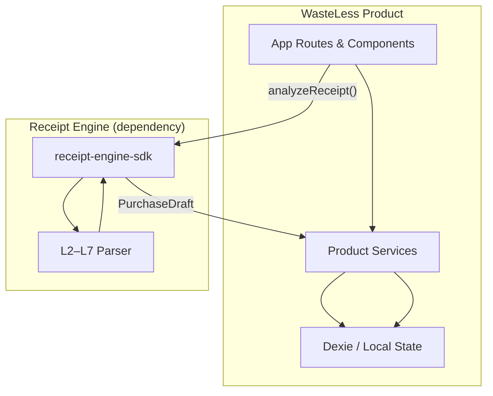

# WasteLess — Product Architecture

WasteLess is a **spending intelligence product**. The Receipt Engine is external infrastructure consumed only through the SDK public API.

## Layer model



| Layer | Responsibility | Key paths |
|-------|----------------|-----------|
| **UI** | Routes, components, PWA shell | `src/app/`, `src/components/` |
| **Product services** | Analytics, insights, memory, categories | `src/lib/analytics.ts`, `src/lib/insights/`, `src/lib/product-analytics.ts` |
| **Persistence** | Expenses, settings, corrections | `src/lib/db.ts`, `src/hooks/use-store.ts` |
| **Receipt Engine SDK** | OCR → PurchaseDraft (black box) | `src/lib/receipt-engine-sdk/` |

## Data flow — receipt scan

1. User uploads photo on `/add`
2. App calls `analyzeReceipt()` via `receipt-engine-analyze.ts`
3. SDK returns `PurchaseDraft` + validation
4. `expense-factory` maps to `Expense` (product domain)
5. User reviews in `ReviewForm`, saves to Dexie
6. Dashboard, memory, insights read from Dexie only

**Rule:** UI and Dexie never import parser layer types directly for new features. Prefer `Expense`, `ReceiptItem`, `AppSettings`.

## Core product modules

| Module | Purpose |
|--------|---------|
| **Dashboard** (`/`) | Period spend, trends, categories, assistant |
| **Purchase Memory** (`/memory`) | Product search, price history |
| **Insights** (`/insights`) | Local proactive insights (no LLM) |
| **Reports** (`/reports`) | Monthly/yearly summaries |
| **Onboarding** (`/onboarding`) | First-run experience |
| **Categories / Tags** | Hierarchy analytics (fuel, smoking, grocery) |

## Receipt Engine boundary

```
WasteLess App
    │
    ▼
receipt-engine-analyze.ts  ← thin adapter
    │
    ▼
@/lib/receipt-engine-sdk/analyzeReceipt()
    │
    ▼
PurchaseDraft + ValidationReport
```

Do not import `layer-*`, `receipt-engine/types/models/*` in new product code except the analyze adapter and review mapping.

## Premium (planned)

Feature gates live in product layer only — engine output is identical for all tiers. See `PRODUCT_ROADMAP.md`.
