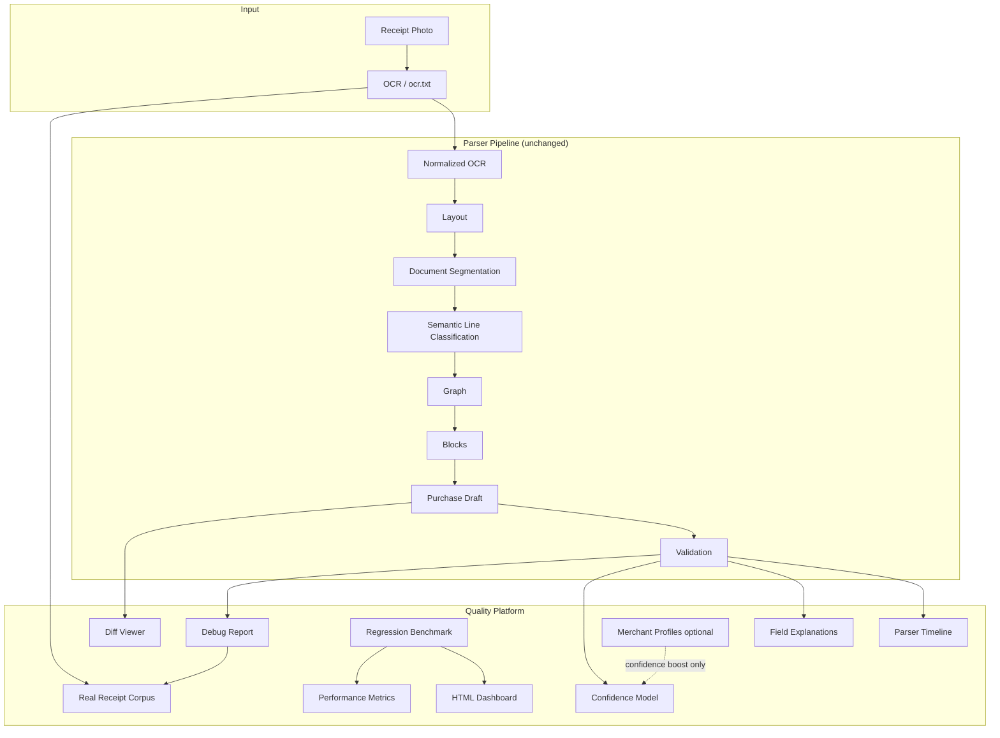

# Receipt Engine Quality Platform

Observability layer around the Receipt Engine parser — **no parser redesign**.

## Architecture



## Debug pipeline

1. `runQualityPipelineFromOcr(ocr)` — L2–L7 with timings
2. `buildParserTimeline(outputs)` — 10 inspectable stages
3. `buildFieldExplanations(outputs)` — post-hoc from provenance
4. `buildConfidenceModel(outputs)` — merchant → overall breakdown
5. `buildDebugReport(outputs, { receiptId })` — sections, rejections, validation

## Corpus structure

```
fixtures/corpus/{slug}/
  ocr.txt              ← immutable (from real fixtures)
  normalized.txt
  layout.json
  segmentation.json
  graph.json
  purchaseDraft.json
  validation.json
  golden.json
  debugReport.json
  receipt.jpg          ← optional
  vision.json          ← optional
```

## Commands

```bash
# Build corpus artifacts
npm run corpus:build

# Run quality tests + golden regression + dashboard
npm run test:quality

# Dashboard only
npm run quality:dashboard
```

Outputs:
- `reports/regression-dashboard.html`
- `reports/receipt-diff.html`
- `reports/performance.json`
- `reports/last-run.json` (trend baseline)

## Merchant profiles

Optional profiles in `profiles/merchantProfileRegistry.ts` — confidence boost only. Parser always works with `generic-tr` default.

## Files added

- `src/lib/receipt-engine-quality/` — platform module
- `src/lib/receipt-engine/fixtures/corpus/` — generated corpus (via `corpus:build`)

## Files modified

- `package.json` — `corpus:build`, `quality:dashboard`, `test:quality`
