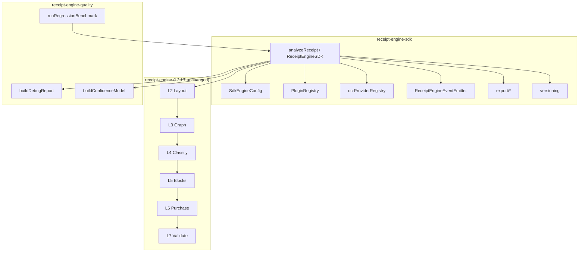

# Receipt Engine SDK Architecture

The Receipt Engine SDK wraps the existing L0–L7 parser pipeline without modifying layer internals. WasteLess is one consumer; the SDK is standalone.

## Layer diagram

## Design principles

1. **Parser immutability** — L2–L7 logic is invoked, never rewritten.
2. **Orchestration at SDK boundary** — lifecycle events emit after each stage in `orchestratePipeline.ts`.
3. **Config-driven behavior** — merchant profiles, OCR provider, modes, and plugins adjust SDK behavior without parser changes.
4. **Zero UI coupling** — no imports from `@/app` or React components.

## Module map

| Module | Responsibility |
|--------|----------------|
| `analyzeReceipt.ts` | Public entry, result assembly |
| `orchestratePipeline.ts` | Stage-by-stage orchestration + events |
| `config/SdkEngineConfig.ts` | Extended engine configuration |
| `plugins/` | Optional app-specific extensions |
| `ocr/` | Provider registry + stubs |
| `export/` | JSON, CSV, Excel, Markdown, HTML, bundles |
| `events/lifecycle.ts` | Pipeline lifecycle hooks |
| `versioning/` | Version metadata on every result |
| `benchmark/` | SDK benchmark wrapper |
